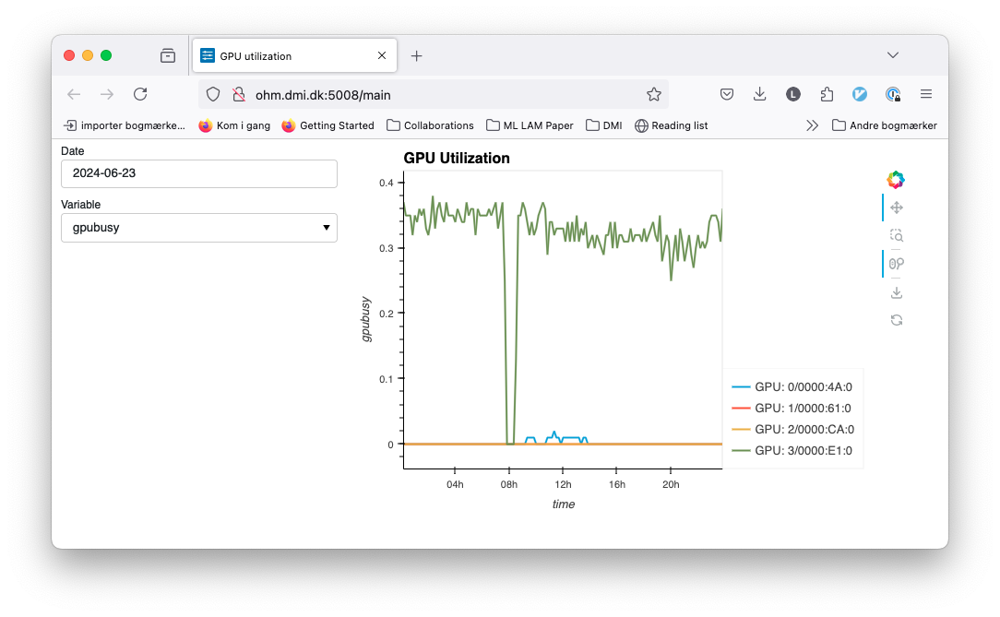

# atopgpu-viz

Visualiser built on [atop](https://github.com/Atoptool/atop) logging to show GPU utilisation.



## Installation

```
python -m pip install .
```


## Usage

```bash
pdm run python -m panel serve atopgpu_viz/main.py --show --address 0.0.0.0 --allow-websocket-origin=ohm.dmi.dk:5008 --port 5008
```